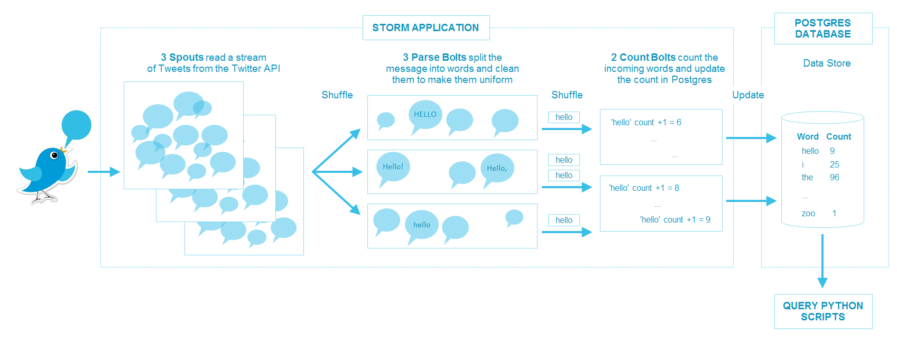

# Twitter Streaming Application

**Andrea Soto | Exercise 2 | MIDS W205 - Storing and Retrieving Data**

This README.md file was created with the notebook [Project Report.ipynb](Project Report.ipynb)
---

## Project Overview

In this exercise I developed an application that reads a stream of tweets from the Twitter API, parses the tweets to count the number of occurrences of each word in the stream of tweets, and writes the final results to a Postgres database.

The architecture is shown in the image below.

The main directories of the project are:

- **EX2Tweetwordcount:** Location of the storm project where the spouts, bolts, and topology scripts reside
- **analysis:** Location of the python servicing scripts that query the Postgres database
- **screenshots:** Location of the three screen-shots that show the end-to-end execution of the application

The description of the main files of the project and their location are shown in the tables below.

### Storm Application Files
|File Name|Location|Description|
|:--|:--|:--|
|tweetwordcount.clj  |./EX2Tweetwordcount/topologies/|Application topology|
|tweets.py|./EX2Tweetwordcount/src/spouts/|Spout to collect tweets|
|parse.py|./EX2Tweetwordcount/src/bolts/|Bolt to parse tweet and clean words|
|wordcount.py|./EX2Tweetwordcount/src/bolts/|Bolt to count words and update Postgres|

### Servicing Files (Query Postgres Database)
|File Name|Location|Description|
|:--|:--|:--|
|finalresults.py|./analysis/|Return the count of a word. If a word is not provided, it returns all word counts|
|histogram.py|./analysis/|Return all words with count between a given interval|
|top20.py|./analysis/|Return the top-20 words by count and create a bar-chart saved as 'plot.png'|

For a detail report see the notebook **[Project Report.ipynb](Project Report.ipynb)**. The code and scripts were developed in the notebook **[Develop Code.ipynb](Develop Code.ipynb)**.
