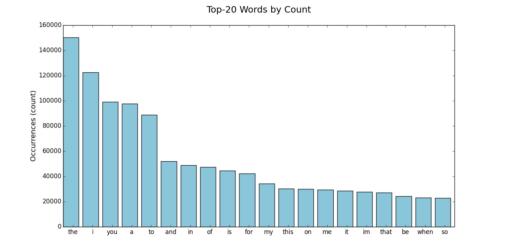

# Twitter Streaming Application

**Andrea Soto | Exercise 2 | MIDS W205 - Storing and Retrieving Data**

---

## Project Overview

In this exercise I developed an application that reads a stream of tweets from the Twitter API, parses the tweets to count the number of occurrences of each word in the stream of tweets, and writes the final results to a Postgres database.

The architecture is shown in the image below.

> ADD IMAGE HERE

The directory structure of the project is shown below.


```python
!tree -I 'streamparse_tweetwordcount*|_build*|_resources'
```

    .
    |-- Description of Serving Scripts.ipynb
    |-- Develop Code.ipynb
    |-- EX2Tweetwordcount
    |   |-- config.json
    |   |-- dev-resources
    |   |-- fabfile.py
    |   |-- logs
    |   |-- project.clj
    |   |-- src
    |   |   |-- bolts
    |   |   |   |-- __init__.py
    |   |   |   |-- parse.py
    |   |   |   `-- wordcount.py
    |   |   `-- spouts
    |   |       |-- __init__.py
    |   |       `-- tweets.py
    |   |-- tasks.py
    |   |-- test
    |   |-- topologies
    |   |   `-- tweetwordcount.clj
    |   `-- virtualenvs
    |       `-- wordcount.txt
    |-- Jupyter Notebook.ipynb
    |-- README.md
    |-- analysis
    |   |-- finalresults.py
    |   |-- histogram.py
    |   |-- plot.png
    |   `-- top20.py
    `-- screenshots
    

    11 directories, 19 files

```python
<style>
table {float:left}
</style>
```


<style>
table {float:left}
</style>


The main directories of the project are:

- **EX2Tweetwordcount:** Location of the storm project where the spouts, bolts, and topology scripts reside
- **analysis:** Location of the python servicing scripts that query the Postgres database
- **screenshots:** Location of the three screen-shots that show the end-to-end execution of the application

The description of the main files of the project and their location are shown in the tables below.

### Storm Application Files
|File Name|Location|Description|
|:--|:--|:--|
|tweetwordcount.clj  |./EX2Tweetwordcount/topologies/|Application topology|
|tweets.py|./EX2Tweetwordcount/src/spouts/|Spout to collect tweets|
|parse.py|./EX2Tweetwordcount/src/bolts/|Bolt to parse tweet and clean words|
|wordcount.py|./EX2Tweetwordcount/src/bolts/|Bolt to count words and update Postgres|

### Servicing Files (Query Postgres Database)
|File Name|Location|Description|
|:--|:--|:--|
|finalresults.py|./analysis/|Return the count of a word. If a word is not provided, it returns all word counts|
|histogram.py|./analysis/|Return all words with count between a given interval|
|top20.py|./analysis/|Return the top-20 words by count and create a bar-chart saved as 'plot.png'|

---
## Streaming Overview

The following commands were used to run the storm application and collect tweets:

> `cd EX2Tweetwordcount`  

> `sparse run`

Tweets were collected for approximately one day starting December 3 and ending December 4. The number of distinct words encountered and the total count of all words is shown below.

Number of distinct words:	61,569
Total count of all words:	3,702,525


---
# Servicing scripts

This section describes how to use the three servicing scripts. The following descriptions assumed the scripts are runned from the main project directory.

---
# finalresults.py

Given a word, return the total number of occurrences of the word in the stream. 

If a word is not provided, it returns all the word counts in alphabetical order. Since there are over 60,000 words, the outpt is limited to the first N word counts. The parameter N can be sent as an input, with the default being 25 words.

**USAGE**

To get the number of occurances of a single word:  
> `python analysis/finalresults.py hello`
    
Get all the word counts, sorted alphabetically, one per line:
> `python analysis/finalresults.py`
    
By default, only the first 25 words are printed to the console. The number of words shown can be increased by sending an integer as a parameter. The example below would show the first 500 words.
> `python analysis/finalresults.py 500`

## Sample Output of `finalresults.py`

The following examples show queries while the stream application was running and after the applicaiton was terminated. 

The queries done while the application was running were used to make sure the application was running properly and that the counts were increasing. It was interesting to see how the words in the results change over time.

### Query all words


```python
# Query at the beginning of tweet collection
!python analysis/finalresults.py 10
```

    First 10 word-counts (out of 777 words):

    

            Word  Count

               a  63

            able  2

           about  7

       according  1

         account  2

        actually  3

         address  3

           adele  1

          adidas  2

           after  1


```python
# Query after some time had pass
!python analysis/finalresults.py 10
```

    First 10 word-counts (out of 10059 words):

    

            Word  Count

               a  4168

          aaaaah  2

          aaaand  2

           aampa  2

           aampp  2

           aaood  2

           aaron  2

          aatuit  2

              ab  12

         abandon  2


```python
# Query at the end of tweet collection
!python analysis/finalresults.py 10
```

    First 10 word-counts (out of 61569 words):

    

            Word  Count

               `  1

               a  97611

              aa  31

             aaa  12

            aaaa  4

           aaaaa  2

          aaaaaa  5

      aaaaaaaaaa  2

     aaaaaaaaaaa  1

    aaaaaaaaaaaaaaahhhhh  2


### Query word 'the' at different moments


```python
!python analysis/finalresults.py the
```

    Number of occurences of 'the':  4585 	@ Thu Dec  3 03:37:58 2015


```python
!python analysis/finalresults.py the
```

    Number of occurences of 'the':  60769 	@ Thu Dec  3 05:16:51 2015


```python
!python analysis/finalresults.py the
```

    Number of occurences of 'the':  150201 	@ Fri Dec  4 03:06:11 2015


```python
# Final count of 'the'
!python analysis/finalresults.py the
```

    Number of occurences of 'the':  150201 	@ Fri Dec  4 03:06:32 2015


---
# histogram.py

Given an interval defined by two integers k1 and k2, return all the words that have a count between the interval (including interval limits).

**USAGE**

To get all the words with a frequency between 1500 and 2000:  
> `python analysis/histogram.py 1500 2000`

By default, only the first 25 words are printed to the console. The number of words shown can be increased by sending a third integer as a parameter. The example below would show the first 50 words.
> `python analysis/histogram.py 1500 2000 50`

## Sample Output of histogram.py


```python
# Query while stream application was running
!python analysis/histogram.py 1000 1100
```

    Reporting 5 words (out of 5 words):

    

            Word  Count

             our  1040

             her  1047

          weeknd  1070

           would  1072

            back  1087


```python
# Query after termination
!python analysis/histogram.py 1000 1100
```

    Reporting 25 words (out of 32 words):

    

            Word  Count

    relationship  1002

          chance  1005

           smile  1007

            fans  1008

              yo  1009

            asks  1010

             far  1020

         answers  1020

           media  1026

            full  1026

            gone  1031

            mama  1031

            must  1034

         prayers  1035

            past  1042

            turn  1042

             wow  1044

           hours  1045

        probably  1046

           story  1048

            fall  1049

          havent  1051

           least  1064

               s  1069

        violence  1082


```python
# Increase words shown to 30
!python analysis/histogram.py 1000 1100 30
```

    Reporting 30 words (out of 32 words):

    

            Word  Count

    relationship  1002

          chance  1005

           smile  1007

            fans  1008

              yo  1009

            asks  1010

             far  1020

         answers  1020

           media  1026

            full  1026

            gone  1031

            mama  1031

            must  1034

         prayers  1035

            past  1042

            turn  1042

             wow  1044

           hours  1045

        probably  1046

           story  1048

            fall  1049

          havent  1051

           least  1064

               s  1069

        violence  1082

             top  1082

            goes  1083

              vs  1086

            rest  1087

            true  1092


---
# top20.py

This script finds the top-20 words by count.

It prints the words to the console and creates a bar-chart called `plot.png` in the directory where the script is called. If plot.png already exitst, the file will be overwritten.

In the example below, the script was run from the project directory. The file `plot.png` was then moved to the analysis folder.

**USAGE**

To get the top-20 words by count:  
> `python analysis/top20.py`

### Sample Output


```python
!python analysis/top20.py
!mv plot.png analysis/
```

    Top-20

    ID     Word  Count

     1       the  150201

     2         i  122672

     3       you  99256

     4         a  97611

     5        to  88872

     6       and  51924

     7        in  48953

     8        of  47513

     9        is  44492

    10       for  42390

    11        my  34410

    12      this  30196

    13        on  29920

    14        me  29550

    15        it  28681

    16        im  27679

    17      that  27270

    18        be  24402

    19      when  23132

    20        so  22948



